# 🔐 Generador de Contraseñas Seguras

Proyecto académico para la materia de Construcción y Evolución de Software.

## 📖 Descripción

Aplicación de línea de comandos en Node.js que genera contraseñas seguras y aleatorias con diferentes opciones de personalización. Incluye validación de fortaleza de contraseñas.

## ✨ Características

- 🎲 Generación de contraseñas aleatorias
- ⚙️ Opciones personalizables (longitud, caracteres)
- 💪 Validación de fortaleza
- 📊 Análisis detallado de seguridad
- 🔢 Generación múltiple de contraseñas
- 📊 Historial temporal de contraseñas
- ✅ Tests unitarios completos

## 🚀 Instalación y Ejecución Local

### Requisitos Previos

- Node.js 18.x o superior
- npm (incluido con Node.js)
- Git

### Pasos de Instalación

1. **Clonar el repositorio:**
```bash
git clone https://github.com/tu-organizacion/tu-repo.git
cd tu-repo
```

2. **Instalar dependencias:**
```bash
npm install
```

3. **Ejecutar la aplicación:**
```bash
npm start
```

4. **Ejecutar tests:**
```bash
npm test
```

5. **Verificar código (Lint):**
```bash
npm run lint
```

6. **Verificar formato:**
```bash
npm run format:check
```

7. **Formatear código automáticamente:**
```bash
npm run format
```

## 🎮 Uso de la Aplicación

Al ejecutar `npm start`, verás un menú interactivo:

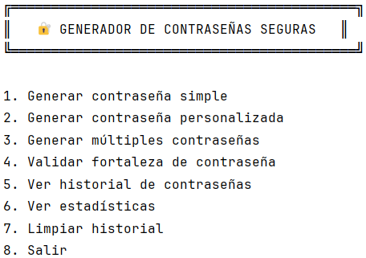

### Ejemplos de Uso

**Opción 1: Contraseña Simple**

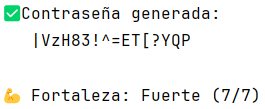

**Opción 2: Contraseña Personalizada**

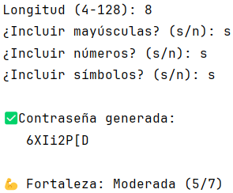

**Opción 3: Múltiples contraseñas**

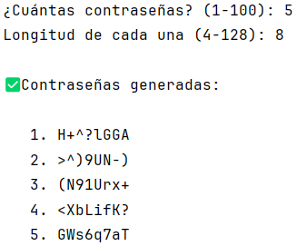

**Opción 4: Validar Contraseña**

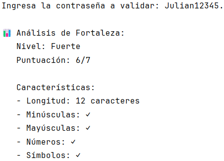

**Opción 5: Historial de Contraseñas**

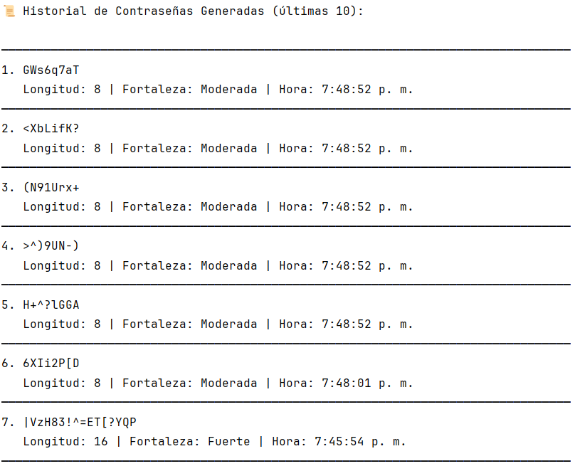

**Opción 6: Estadísticas de Contraseñas**

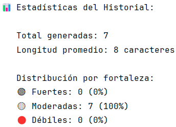

**Opción 7: Limpiar Historial de Contraseñas**

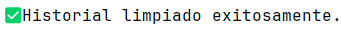

**Opción 8: Salir**


## 🔄 Pipeline de CI/CD

### Descripción del Flujo

El pipeline se ejecuta automáticamente en cada `push` y `pull request` a las ramas `main`, `develop` y `feature/*`.

### Jobs del Pipeline

#### 1️⃣ **Lint (ESLint)** 🔍
- **Propósito:** Analizar el código en busca de errores y malas prácticas
- **Herramienta:** ESLint
- **Verifica:**
    - Errores de sintaxis
    - Cumplimiento de estándares de código
    - Variables no utilizadas
    - Problemas potenciales

#### 2️⃣ **Format Check (Prettier)** ✨
- **Propósito:** Validar formato consistente del código
- **Herramienta:** Prettier
- **Verifica:**
    - Indentación correcta (2 espacios)
    - Uso de comillas simples
    - Punto y coma al final de sentencias
    - Longitud de línea (80 caracteres)

#### 3️⃣ **Test (Jest)** ✅
- **Propósito:** Ejecutar suite de pruebas unitarias
- **Herramienta:** Jest
- **Ejecuta:**
    - 19 tests unitarios
    - Reporte de cobertura de código
    - Validación de funcionalidad
- **Cobertura esperada:** > 90%

#### 4️⃣ **Build** 📦
- **Propósito:** Verificar que el proyecto se construye correctamente
- **Dependencias:** Requiere que Lint, Format y Test pasen exitosamente
- **Genera:**
    - Artefactos de construcción
    - Validación de que el proyecto puede ejecutarse

### Diagrama de Flujo
```
┌─────────────────────────────────────────────┐
│  Push / Pull Request                        │
└────────────┬────────────────────────────────┘
             │
    ┌────────┴────────┐
    │                 │
┌───▼────┐  ┌────▼────┐  ┌────▼────┐
│  Lint  │  │ Format  │  │  Test   │
│🔍ESLint│  │✨Prettier│  │ ✅Jest  │
└───┬────┘  └────┬────┘  └────┬────┘
    │            │            │
    └────────┬───┴─────┬──────┘
             │         │
         ┌───▼─────────▼───┐
         │   Build 📦      │
         │   (si todo OK)  │
         └─────────────────┘
```

### Resultados Esperados

✅ **Pipeline Exitoso:**
- Todos los jobs en verde ✓
- Sin errores de lint
- Código formateado correctamente
- Todos los tests pasan
- Build generado exitosamente

❌ **Pipeline Fallido:**
- Uno o más jobs en rojo ✗
- Se muestran logs de error detallados
- El build no se ejecuta si fallan los checks previos

## 📸 Capturas de Pantalla

### Ejecución Local Exitosa


### Tests Pasando

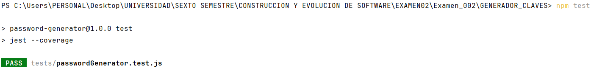

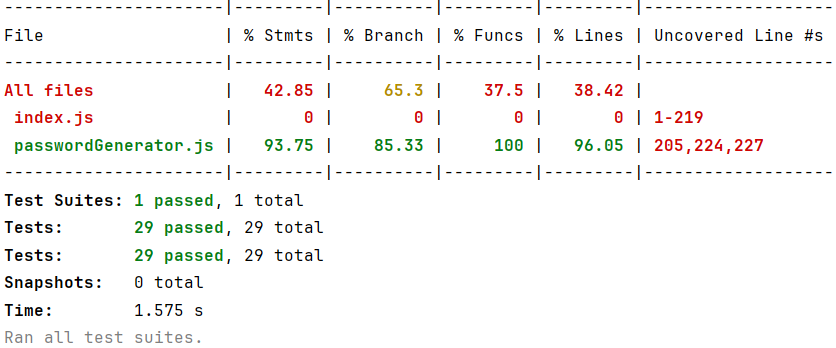

### Tipos de Tests

- ✅ Tests unitarios de generación
- ✅ Tests de validación
- ✅ Tests de casos límite
- ✅ Tests de manejo de errores
- ✅ Tests de opciones personalizadas

### Pipeline de CI/CD funcionando correctamente

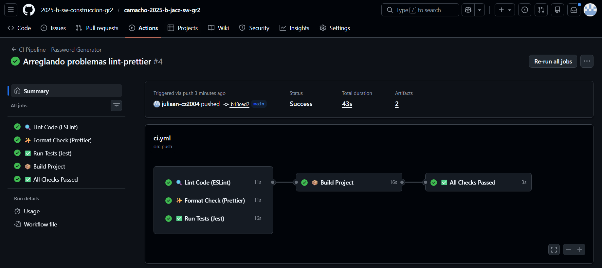

## 👥 Contribución

### Cómo Contribuir

1. Fork del proyecto
2. Crear feature branch
3. Commit de cambios
4. Push a la branch
5. Crear Pull Request

## 📚 Tecnologías Utilizadas

- **Runtime:** Node.js 18+
- **Testing:** Jest
- **Linting:** ESLint
- **Formatting:** Prettier
- **CI/CD:** GitHub Actions

## 📝 Licencia

Este proyecto está bajo la Licencia MIT - ver el archivo LICENSE para más detalles.

## 📧 Contacto

**Estudiante:** Julián Camacho  
**Correo:** julian.camacho@epn.edu.ec
